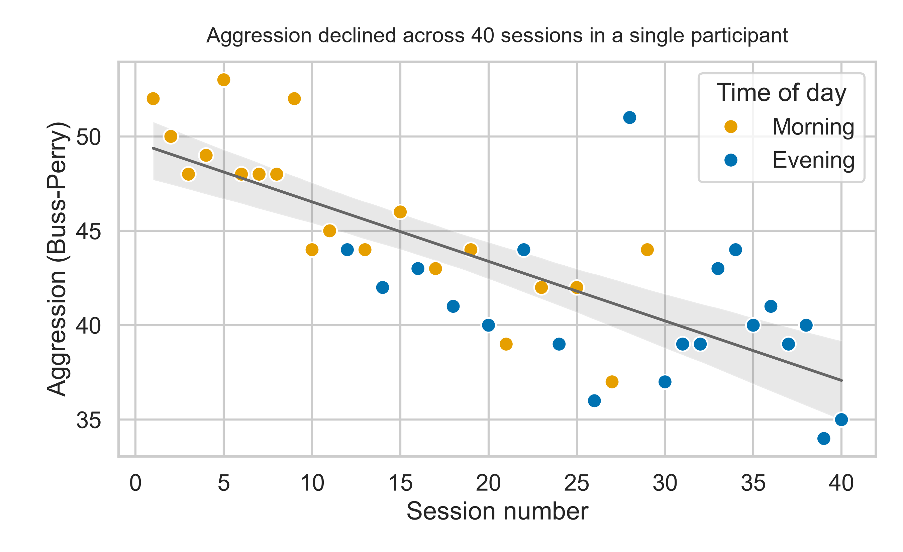

[README_final (1).md](https://github.com/user-attachments/files/32549763/README_final.1.md)
# Hormones, Stress, and Aggression Across Repeated Sessions

This is a reanalysis of an open-access dense sampling dataset on whether testosterone, cortisol, stress, mood, and sleep predicted day to day aggression. This study was done on a dataset where one man was measured a total of 40 times, 20 in the mornings and 20 in the evenings.

**Main finding:** There was initial correlation, at first the data looked strong, however after the data was controlled for session order and time of day, the only effect that held up was aggression steadily dropping across sessions, which is probably due to habituation from taking the same questionnaire 40 different times.



## Data

The dataset in this study came from OpenNeuro Dataset [ds005115](https://openneuro.org/datasets/ds005115) ("28andHe"), originally collected by the original authors for a different purpose. Furthermore this repository contains no new data collections, it is only an independent reanalysis of publicly available measures.

## Research question

Do day to day fluctuations in hormones, stress, mood, or sleep stand as a factor that predict day to day fluctuations in self-reported aggression?

## Analyses

`week1_aggression_hormones.py`

- There was zero-order correlation between hormones and aggression
- Identification of session order and time of day as confounds
- OLS regression controlling for both

`week2_extended_analysis.py`

- Added and tested two more predictors, how angry he felt that day, and how well he slept
- Compared each session to the one before it (difference scores), which cancels out the steady downward drift in aggression scores
- Re-checked the main results with statistics that account for nearby sessions resembling each other
- Made the final figure

## Results

| Predictor | Controlled model | Difference scores |
|---|---|---|
| Salivary testosterone | *p* = .710 | *p* = .204 |
| Salivary cortisol | *p* = .578 | *p* = .223 |
| Perceived stress | *p* = .301 | *p* = .149 |
| Same-day anger (POMS) | *p* = .549 | *p* = .803 |
| Sleep quality (PSQI) | *p* = .417 | *p* = .115 |
| **Session number** | ***p* < .001** | — |

*Note.* Testosterone, cortisol, and perceived stress were each tested in their own controlled model; anger and sleep quality were tested together. Every controlled model includes session number and time of day. In the difference-score analyses, testosterone was paired with cortisol and anger was paired with perceived stress; sleep quality is reported as a plain correlation (*r* = -.257).

His testosterone was substantially higher in the morning sessions compared to the evening (mean salivary testosterone 101.6 vs. 37.9), and most of the early sessions happened disproportionately in the morning. So aggression and hormones lined up simply because of when the session took place, not because hormones drive aggression.

Looking at session to session change instead of just raw scores, stress (*r* = .25) and sleep quality (*r* = -.26) had the strongest connection to aggression while these scores pointed towards connecting poorer sleep and high stress to increased aggression. Overall this is also what earlier research would predict, but neither results were strong enough to count.

The decline across sessions held up when I reran it with statistics that account for nearby sessions resembling each other (*z* = -6.12), so it wasn't just a side effect of the sessions being clustered in time.

## Limitations

- This was a study on a single participant, cannot be generalized across different individuals
- There were only 40 observations, and that provides limited power to detect smaller effects, such as the direction-consistent stress association
- Morning and evening sessions were not counterbalanced across the study, confounding the time of day with session order
- There was no measurement of baseline life stress, working conditions, and participant expectations, and these may influence self-reported aggression

## Reproducing

Reproducing this analysis requires Python with pandas, matplotlib, seaborn, statsmodels, and scipy (which is all included in Anaconda). When you run the scripts it will download the data automatically.

```
python week1_aggression_hormones.py
python week2_extended_analysis.py
```

## Author

Qipeng (Aaron) An, Psychology, University of California, Merced
